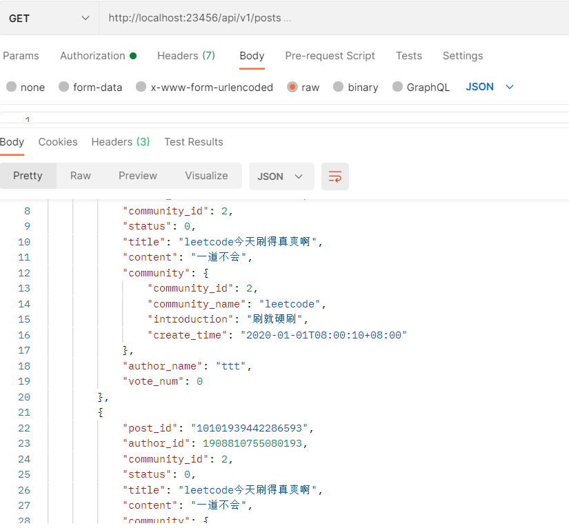

# bluebell
## 技能清单

1. gin框架
2. zap日志库
3. Viper配置管理
4. swagger生成文档
5. JWT认证
6. 令牌桶限流
7. Go语言操作MySQL
8. Go语言操作Redis

## 接口测试
- **postman工具**

## 项目全套笔记
- **基于雪花算法生成用户ID**
- - https://www.yuque.com/docs/share/e50bbca1-e019-45e2-b77b-a9ba01fbede3?# 《基于雪花算法生成用户ID》
- [gin框架中使用validator若干实用技巧](https://www.liwenzhou.com/posts/Go/validator_usages/)
- [《限制账号同一时间只能登录一个设备》](https://www.yuque.com/docs/share/584ddd0f-5158-4cea-8918-a4b6e1d41a07?# )
- [《基于Cookie、Session和基于Token的认证模式介绍》](https://www.yuque.com/docs/share/06a89a55-3e3c-452b-aeb1-acf4d2bac8a5?#)
- [在gin框架中使用JWT认证](https://www.liwenzhou.com/posts/Go/jwt_in_gin/)
- [为Go项目编写Makefile](https://www.liwenzhou.com/posts/Go/makefile/)
- [使用Air实现Go程序实时热重载](https://www.liwenzhou.com/posts/Go/live_reload_with_air/)
- [分页](https://zhidao.baidu.com/question/1573826651037645420.html)
- [JSON实战拾遗之数字精度](https://www.ituring.com.cn/article/506822)
- [你需要知道的那些go语言json技巧](https://www.liwenzhou.com/posts/Go/json_tricks_in_go)
- [帖子投票（点赞）功能设计与实现](https://www.yuque.com/docs/share/d09afe84-90d1-4e04-a73e-95848f073558?#)
- [《基于用户投票的排名算法》](https://www.yuque.com/docs/share/f40f5c41-f327-47d4-88bb-02bcf62515a8?# )
- [使用swagger生成接口文档](https://www.liwenzhou.com/posts/Go/gin_swagger/)
- [HTTP Server常用压测工具介绍](https://www.liwenzhou.com/posts/Go/benchmark_tool/)
- [漏桶和令牌桶限流策略介绍及使用](https://www.liwenzhou.com/posts/Go/ratelimit/)
- [option选项模式](https://www.liwenzhou.com/posts/Go/functional_options_pattern/)
- [Go pprof性能调优](https://www.liwenzhou.com/posts/Go/performance_optimisation/)
- [如何使用docker部署Go Web程序](https://www.liwenzhou.com/posts/Go/how_to_deploy_go_app_using_docker/)
- [部署Go语言程序的N种方法](https://www.liwenzhou.com/posts/Go/deploy_go_app/)
- [《企业代码发布流程及CICD介绍》](https://www.yuque.com/docs/share/e837e5bf-f6a9-4dc8-98e4-4b8ce24808ab?)
